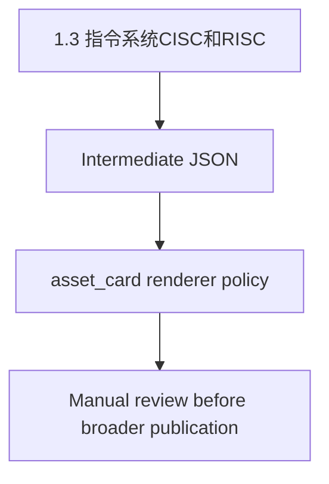

# 1.3 指令系统CISC和RISC

> Phase 4.2 controlled baseline-set official render. Renderer policy: `asset_card`. This document uses only the frozen renderer input contract, intermediate JSON, and asset manifest metadata when present.

## Core Concept / 核心概念

Renderer policy: `asset_card`.
中间层文本有限；本节仅呈现已抽取内容，不补写缺失内容。

已抽取内容（保持原始含义，仅做列表化呈现）：

- CISC是复杂指令系统：兼容性强，指令繁多、长度可变，由微程序实现。
- RISC是精简指令系统：指令少，使用频率接近，主要依靠硬件实现(通用寄存器、硬布线逻辑控制)。
- 二者各方面区分如下图：

已抽取 key_terms（仅来自 intermediate JSON）：

- 兼容性强
- 指令繁多
- 长度可变
- 微程序
- 指令少
- 硬件实现
- CISC是复杂指令系统：

## Architectural Topology & Visualization / 架构拓扑与可视化

Renderer-generated structural placeholder; not reconstructed from image content.

Renderer policy: `asset_card`.
本知识点包含图片型资料。
图片只作为 asset_ref 保留。
asset_ref 只是引用，不代表 renderer 已理解图片内容。
Renderer 未 OCR。
Renderer 未还原图片表格。
图片内容需人工复核。
sha256 / saved_path / content_type / dimensions 是资产定位信息，不是知识解释。
不根据图片内容自动还原，不根据图片自动写 CISC/RISC 对比表内容。

Asset refs:

- asset_ref order=0
  - original_url: https://image-t.chaiding.com/ruankao/20240808/d2d172a92eaf4055aa7852d56a4cacb4.jpg-ruankao
  - saved_path: sources/ruankaodaren/raw/assets/images/f6a73666c2cbb2b95a8a9be6606abdb9bb7d90aa81c2e66fd5b2a84cc05d1701.png
  - sha256: f6a73666c2cbb2b95a8a9be6606abdb9bb7d90aa81c2e66fd5b2a84cc05d1701
  - content_type: image/png
  - width: 624
  - height: 206
  - manual_review_required: true
  - manual_review_reason: image may contain table or non-text instructional content

## Deterministic Constraints / 决定论约束

本节需要人工根据正式教材或考试大纲补充；renderer 不从图片或缺失上下文推断，不补写缺失内容。

## Ruankao Alignment / 软考考点映射

基于标题和已抽取文本的保守映射：`1.3 指令系统CISC和RISC`。
本节不写未来源支持的考试结论，不改写软考内容，不补写缺失内容。

## Case Study Answer Pattern / 案例分析答题模式

- 问题背景：待人工结合正式题目补充。
- 关键约束：待人工结合正式题目补充。
- 失效模式：待人工结合正式题目补充。
- 改造方向：待人工结合正式题目补充。

本 official render 只输出答题框架，不写具体答案，不补写缺失内容。

## Paper Usage / 论文可复用方式

- 可作为论文素材索引项。
- 需人工复核后再提炼为论文表述。
- 本 renderer 不生成未来源支持的论文段落，不补写缺失内容。

## Source Reference / 来源引用

- renderer input contract path: `verification/generated/phase3_25_renderer_input_contract.json`
- renderer baseline manifest path: `verification/generated/phase3_23_renderer_baseline_manifest.json`
- intermediate JSON path: `data/intermediate/ruankaodaren/samples/2026-05-26T09-40-21-903Z.json`
- asset manifest path: `sources/ruankaodaren/raw/assets/manifests/2026-05-26T09-40-21-903Z.json`
- source timestamp: `2026-05-26T09-40-21-903Z`
- asset sha256: `f6a73666c2cbb2b95a8a9be6606abdb9bb7d90aa81c2e66fd5b2a84cc05d1701`
- asset saved_path: `sources/ruankaodaren/raw/assets/images/f6a73666c2cbb2b95a8a9be6606abdb9bb7d90aa81c2e66fd5b2a84cc05d1701.png`
- asset content_type: `image/png`
- asset width / height: `624x206`
- constraints:
  - ocr_used: false
  - encrypted_xhr_decrypted: false
  - image_table_reconstructed: false
  - markdown_generated_before_render: false
- render boundary:
  - 未 OCR
  - 未还原图片表格
  - 未读取 raw HTML
  - 未读取 raw XHR
  - 未使用 web requests
  - 未进行内容补写 / 发明

## Human Review Checklist / 人工复核清单

- [x] 内容是否与正式教材一致。
- [x] 是否需要补充定义 / 特点 / 优缺点。
- [x] 是否需要补充案例分析答题点。
- [x] 是否需要补充论文可用表达。
- [x] 是否需要复核图片资产。
- [x] 是否确认 renderer 未补写缺失内容。

Renderer policy review: `asset_card`

- [ ] `asset_ref` 只是引用，不代表已理解图片内容。
- [ ] 图片内容必须人工阅读。
- [ ] `sha256` / `saved_path` / `content_type` / dimensions 只用于资产定位。
- [ ] 不允许根据图片自动写 CISC/RISC 对比表内容。

## Renderer Boundary / 渲染边界

- 未 OCR。
- 未解密 `encrypt=1`。
- 未还原图片表格。
- 未读取 raw HTML。
- 未读取 raw XHR。
- 未访问网页。
- 未使用 web requests。
- 未补写缺失内容。
