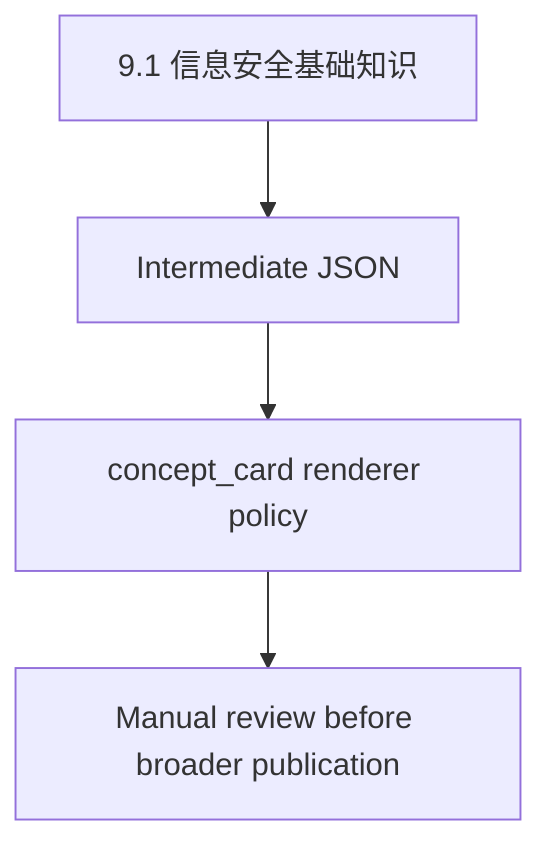

# 9.1 信息安全基础知识

> Phase 4.2 controlled baseline-set official render. Renderer policy: `concept_card`. This document uses only the frozen renderer input contract, intermediate JSON, and asset manifest metadata when present.

## Core Concept / 核心概念

Renderer policy: `concept_card`.
中间层文本有限；本节仅呈现已抽取内容，不补写缺失内容。

已抽取内容（保持原始含义，仅做列表化呈现）：

- 信息安全包括5个基本要素：机密性、完整性、可用性、可控性与可审查性。 (1)机密性：确保信息不暴露给未授权的实体或进程。 (2)完整性：只有得到允许的人才能修改数据，并且能够判别出数据是否己被篡改。 (3)可用性：得到授权的实体在需要时可访问数据，即攻击者不能占用所有的资源而阻碍授权 者的工作。 (4)可控性：可以控制授权范围内的信息流向及行为方式。 (5)可审查性：对出现的信息安全问题提供调查的依据和手段。
- 信息安全包括5个基本要素：
- 机密性
- 、
- 完整性
- 可用性
- 可控性
- 与
- 可审查性
- 。
- (1)
- ：确保信息不暴露给未授权的实体或进程。
- (2)
- ：只有得到允许的人才能修改数据，并且能够判别出数据是否己被篡改。
- (3)
- ：得到授权的实体在需要时可访问数据，即攻击者不能占用所有的资源而阻碍授权
- 者的工作。
- (4)
- ：可以控制授权范围内的信息流向及行为方式。
- (5)
- ：对出现的信息安全问题提供调查的依据和手段。

已抽取 key_terms（仅来自 intermediate JSON）：

- 机密性
- 完整性
- 可用性
- 可控性
- 可审查性
- 机密性
- 完整性
- 可用性
- 可控性
- 可审查性
- 信息安全包括5个基本要素：

## Architectural Topology & Visualization / 架构拓扑与可视化

Renderer-generated structural placeholder; not reconstructed from image content.

Renderer policy: `concept_card`.
Renderer 未 OCR，未还原图片表格；如后续出现图片型资料，只保留 asset_ref，不解释图片内容。

## Deterministic Constraints / 决定论约束

本节需要人工根据正式教材或考试大纲补充；renderer 不从图片或缺失上下文推断，不补写缺失内容。

## Ruankao Alignment / 软考考点映射

基于标题和已抽取文本的保守映射：`9.1 信息安全基础知识`。
本节不写未来源支持的考试结论，不改写软考内容，不补写缺失内容。

## Case Study Answer Pattern / 案例分析答题模式

- 问题背景：待人工结合正式题目补充。
- 关键约束：待人工结合正式题目补充。
- 失效模式：待人工结合正式题目补充。
- 改造方向：待人工结合正式题目补充。

本 official render 只输出答题框架，不写具体答案，不补写缺失内容。

## Paper Usage / 论文可复用方式

- 可作为论文素材索引项。
- 需人工复核后再提炼为论文表述。
- 本 renderer 不生成未来源支持的论文段落，不补写缺失内容。

## Source Reference / 来源引用

- renderer input contract path: `verification/generated/phase3_25_renderer_input_contract.json`
- renderer baseline manifest path: `verification/generated/phase3_23_renderer_baseline_manifest.json`
- intermediate JSON path: `data/intermediate/ruankaodaren/samples/2026-05-28T05-25-27-891Z.json`
- asset manifest path: `(none)`
- source timestamp: `2026-05-28T05-25-27-891Z`
- asset sha256: `(none)`
- asset saved_path: `(none)`
- asset content_type: `(none)`
- asset width / height: `(none)`
- constraints:
  - ocr_used: false
  - encrypted_xhr_decrypted: false
  - image_table_reconstructed: false
  - markdown_generated_before_render: false
- render boundary:
  - 未 OCR
  - 未还原图片表格
  - 未读取 raw HTML
  - 未读取 raw XHR
  - 未使用 web requests
  - 未进行内容补写 / 发明

## Human Review Checklist / 人工复核清单

- [ ] 内容是否与正式教材一致。
- [ ] 是否需要补充定义 / 特点 / 优缺点。
- [ ] 是否需要补充案例分析答题点。
- [ ] 是否需要补充论文可用表达。
- [ ] 是否需要复核图片资产。
- [ ] 是否确认 renderer 未补写缺失内容。

Renderer policy review: `concept_card`

- [ ] 只基于 intermediate `text_blocks` / `key_terms` 做保守组织。
- [ ] 不引入未来源支持的考点判断。
- [ ] 不生成未来源支持的考试结论。
- [ ] 不生成可直接套用论文段落。

## Renderer Boundary / 渲染边界

- 未 OCR。
- 未解密 `encrypt=1`。
- 未还原图片表格。
- 未读取 raw HTML。
- 未读取 raw XHR。
- 未访问网页。
- 未使用 web requests。
- 未补写缺失内容。
