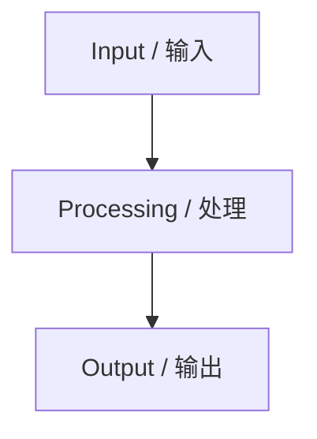

# <Concept English> / <中文术语>

## 1. Core Concept / 核心概念

> 用 3-5 句话说明该概念解决什么架构问题、适用在哪类系统边界内、与相邻概念的区别是什么。

- Problem Context / 问题语境: `<说明该概念出现的系统压力或设计目标>`
- Architectural Role / 架构角色: `<说明它在系统结构中的位置>`
- Boundary / 适用边界: `<说明适用条件与不适用条件>`

## 2. Architectural Topology & Visualization / 架构拓扑与可视化

- Components / 构件: `<列出关键构件>`
- Relationships / 关系: `<说明调用、依赖、数据流或控制流>`
- Invariants / 架构不变量: `<说明拓扑变化时仍必须成立的约束>`

## 3. Deterministic Constraints / 决定论约束

| Constraint / 约束 | Cause / 原因 | Consequence / 结果 | Exam Signal / 考试信号 |
| --- | --- | --- | --- |
| `<约束>` | `<触发原因>` | `<必然影响>` | `<题干中的识别线索>` |

## 4. Trade-off Analysis / 权衡分析

| Option / 方案 | Benefit / 收益 | Cost / 代价 | When To Use / 适用场景 |
| --- | --- | --- | --- |
| `<方案 A>` | `<收益>` | `<代价>` | `<条件>` |
| `<方案 B>` | `<收益>` | `<代价>` | `<条件>` |

## 5. Failure Modes / 失效模式

- Failure Mode / 失效模式: `<说明会如何失败>`
- Root Cause / 根因: `<说明导致失败的约束冲突或设计缺陷>`
- Observable Symptom / 可观测现象: `<说明题干可能如何描述>`
- Mitigation / 缓解方式: `<说明架构层面的改造方向>`

## 6. Ruankao Alignment / 软考考点映射

| Exam Area / 考试模块 | Mapping / 映射方式 | Reusable Answer Element / 可复用答题元素 |
| --- | --- | --- |
| 综合知识 | `<概念、原则、分类或计算点>` | `<短答案表达>` |
| 案例分析 | `<题干约束、问题定位或改造建议>` | `<分点答题结构>` |
| 论文 | `<项目背景、技术选型或质量属性论证>` | `<可复用论述句式>` |

### Case Study Answer Pattern / 案例分析答题模式

1. 识别题干中的业务目标、质量属性和约束。
2. 说明当前架构与约束之间的冲突。
3. 给出分层、分组件或分阶段的改造方案。
4. 说明改造后对性能、可用性、安全性、可维护性等质量属性的影响。

### Paper Usage / 论文可复用方式

- Project Background / 项目背景: `<可放入论文开头的业务场景>`
- Design Decision / 设计决策: `<可展开的技术选型理由>`
- Quality Attribute / 质量属性: `<可证明的质量属性收益>`
- Evaluation / 效果评估: `<可写成结果验证的指标或现象>`

## 7. Source Reference / 来源引用

| Field / 字段 | Value / 值 |
| --- | --- |
| Source URL / 来源 URL | `<url>` |
| Capture Time / 采集时间 | `<ISO-8601 time>` |
| Content Hash / 内容哈希 | `<hash>` |
| Parser Version / 解析器版本 | `<version>` |
| Review Status / 复核状态 | `<unreviewed / reviewed>` |
