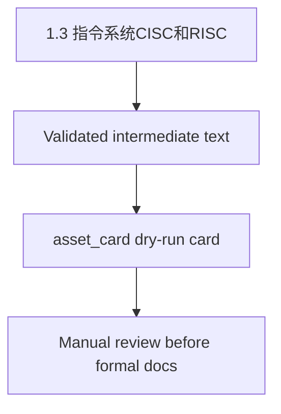

# 1.3 指令系统CISC和RISC

Renderer template: `asset_card`.

Boundary:
- Use only text already present in intermediate JSON.
- Preserve image references as `asset_ref` metadata.
- Do not describe image or table contents.
- Do not read raw HTML or raw XHR.
- Do not use web requests.
- Do not invent, supplement, or rewrite missing content.
- Do not OCR images or reconstruct image tables.

## Core Concept / 核心概念

以下内容仅来自 `intermediate.content.text_blocks`，未从 raw HTML / raw XHR 读取，也不补写缺失内容。

CISC是复杂指令系统：兼容性强，指令繁多、长度可变，由微程序实现。

RISC是精简指令系统：指令少，使用频率接近，主要依靠硬件实现(通用寄存器、硬布线逻辑控制)。

二者各方面区分如下图：

## Architectural Topology & Visualization / 架构拓扑与可视化

Renderer-generated structure placeholder. This Mermaid diagram is a dry-run scaffold, not a recovered source diagram.

### Asset refs / 资产引用

The renderer preserves asset references only. It does not describe image contents, use OCR, or reconstruct image tables.

- asset_ref order=0
  - original_url: https://image-t.chaiding.com/ruankao/20240808/d2d172a92eaf4055aa7852d56a4cacb4.jpg-ruankao
  - saved_path: sources/ruankaodaren/raw/assets/images/f6a73666c2cbb2b95a8a9be6606abdb9bb7d90aa81c2e66fd5b2a84cc05d1701.png
  - sha256: f6a73666c2cbb2b95a8a9be6606abdb9bb7d90aa81c2e66fd5b2a84cc05d1701
  - content_type: image/png
  - width: 624
  - height: 206
  - manual_review_required: true
  - manual_review_reason: image may contain table or non-text instructional content

## Deterministic Constraints / 决定论约束

本节需人工依据正式教材/考试要求补充；renderer 不从图片或缺失上下文推断，不补写缺失内容。

## Ruankao Alignment / 软考考点映射

基于标题的保守映射：`1.3 指令系统CISC和RISC`。dry-run 不补写考试结论，不改写软考内容。

## Case Study Answer Pattern / 案例分析答题模式

Dry-run 仅保留案例分析结构框架：问题背景、约束、失效模式、改造方向。此处不写具体答案。

## Paper Usage / 论文可复用方式

Dry-run 仅保留论文素材结构框架：项目背景、技术选型、质量属性、效果评估。此处不生成可直接套用段落。

## Source Reference / 来源引用

- intermediate path: `data/intermediate/ruankaodaren/samples/2026-05-26T09-40-21-903Z.json`
- asset manifest path: `sources/ruankaodaren/raw/assets/manifests/2026-05-26T09-40-21-903Z.json`
- source timestamp: `2026-05-26T09-40-21-903Z`
- renderer input contract path: `verification/generated/phase3_25_renderer_input_contract.json`
- constraints:
  - ocr_used: false
  - encrypted_xhr_decrypted: false
  - image_table_reconstructed: false
  - markdown_generated: false
- renderer boundary: 不补写缺失内容，不读取 raw HTML / raw XHR，不访问网页。
